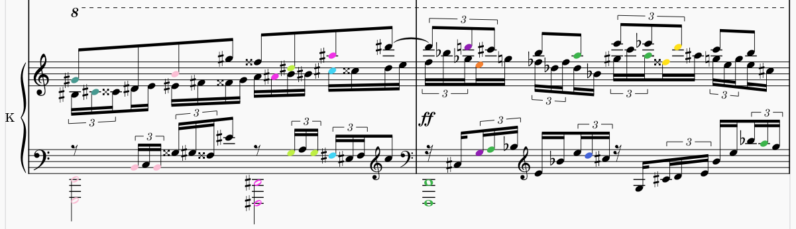
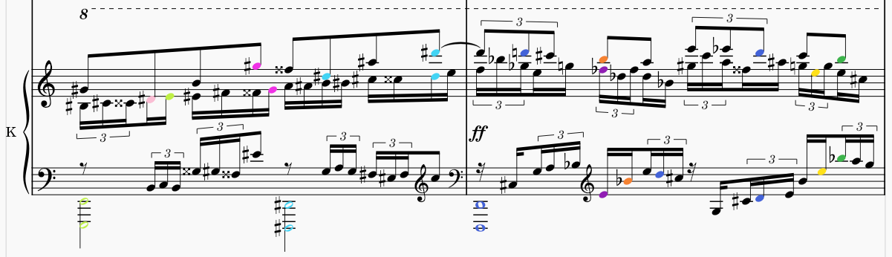

# MuseScore plugins

## Colorize Intervals

This plugin colorizes intervals (semitones modulo 12, sounding, twelve-tone equal temperament) across all staves and voices. One of its use cases is finding consecutive fifths and octaves.

_Result of using the plugin on an unpublished piece of mine, 7 semitones_

_Same bars, 0 semitones_

# Detect repetitions

This plugin detects repetitions of sounding notes across all staves and voices.
